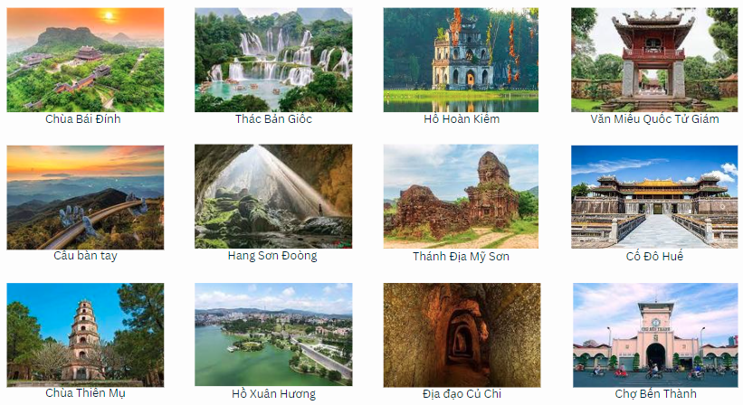
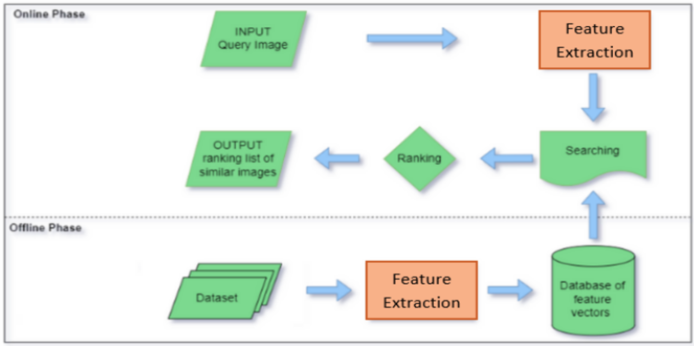

# Image retrieval on Vietnam's destinations dataset

## Introduction

The goal of this project is to provide a solution for information retrieval based on tourism images. Enabling users to search for images of a destination by using another image of that destination as a query. In addition, my team is also built a new dataset specialized for the given task.

## Dataset

Dataset contains 46 different destinations in Vietnam, each destination has roughly 100 images. Total images in the dataset is 9,076 including 1,548 images does not belong to any destination considered as distracted images.

We designed 5 queries for each destination, the ground truth for each query is the all images with respect to the query's destination.

Some examples of the dataset:

## Method

We used a pretrained model to extract features from images, then used these features to build an index for fast retrieval. We utilized the [FAISS library](https://github.com/facebookresearch/faiss) to build the index and perform the search.

Experiments were conducted on four different models: ResNet50, ResNet101, Mobilenetv3 and InceptionV3.

The best model was chosen based on the performance of the retrieval task:

- Index size: space to store the index file, the compactness of feature vector.

- Model size: size of the feature extraction model.

- Search time: time to perform a single search.

- Evaluation metrics: precision at k (P@k), recall at k (R@k), mean average precision (mAP) and Mean Reciprocal Rank (MRR).

## Result

Evaluation of the system was done using precision at k (P@k), recall at k (R@k), mean average precision (mAP) and Mean Reciprocal Rank (MRR).

All results are reported in notebooks at [evaluation results](evaluation_results) folder(the name of the notebook is the name of the model used for the experiment)

The best model is Mobilenetv3 with the impressive performance compared to other models:

- Index size: ~ 44MB (ResNet50: ~70MB, ResNet101: ~70MB, InceptionV3: ~70MB)

- Model size: ~ 126MB (ResNet50: ~376MB, ResNet101: ~592MB, InceptionV3: ~320MB)

- Search time: ~ 0.003s (ResNet50: ~0.005s, ResNet101: ~0.008s, InceptionV3: ~0.007s)

- Evaluation metrics:

  - P@1: 0.9348
  - R@1: 0.0065
  - mAP@1: 0.9348
  - MRR: 0.9348

  _Detail results were shown in evaluation notebooks._

## Application

We also built a simple web application to demonstrate the image retrieval system.

The supported features:

- Search for images of a destination by using another image that is uploaded from user's computer or from an image url.

- Display the list of destionation.

- Display all images of a destination.

- Add new destination.

- Add new images to a destination.

Demo can be found at [here](https://youtu.be/HQevBwrTBFA)
